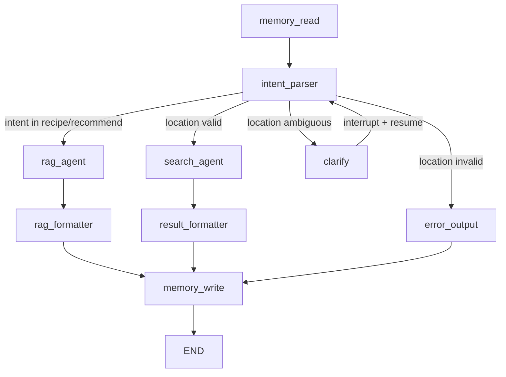

# WhatToEat — 饮食管家 Agent

基于 **LangGraph + RAG + 高德 MCP + 长期记忆** 的对话式饮食推荐 Agent。
提供 **餐厅搜索** 与 **菜谱推荐** 两大能力，支持 Streamlit Web 界面与 FastAPI 后端 API 两种接入方式。

---

## 核心特性

- **双能力路由** — 根据用户意图自动分发到 *餐厅搜索* 或 *菜谱推荐* 两条独立链路
- **长期记忆个性化** — 基于 PostgreSQL 存储用户画像（过敏 / 忌口 / 口味偏好 / 健康目标），跨会话生效
- **多轮澄清** — 缺失关键信息（如位置）时通过 LangGraph `interrupt` 机制反问用户
- **高德 MCP 集成** — 实时调用高德 POI 搜索 / 周边搜索 / 详情查询获取真实餐厅数据
- **Milvus 混合检索 + 重排** — Dense embedding + BM25 → RRF 融合 → Cross-encoder rerank
- **FastAPI 后端 API** — RESTful + SSE 流式输出，前后端分离架构，支持 Alembic 数据库迁移
- **可视化 Agent 路由** — Streamlit 侧栏实时展示当前请求经过的每一个图节点

---

## 技术栈

| 层 | 组件 |
|---|---|
| 编排 | LangGraph 1.2 |
| LLM | DeepSeek Chat |
| 后端框架 | FastAPI + Uvicorn |
| ORM / 迁移 | SQLAlchemy 2.0 (async) + Alembic |
| RAG 向量库 | Milvus Standalone 2.5（hybrid search） |
| Reranker | SiliconFlow `bge-reranker-v2-m3` |
| Embedding | `BAAI/bge-small-zh-v1.5` |
| 餐厅数据源 | 高德 MCP |
| 记忆存储 | PostgreSQL 16（asyncpg） |
| 缓存 | Redis 7 |
| Web 前端 | Streamlit |

---

## 架构



---

## 快速开始

### 前置条件

- Python 3.10+
- Docker & Docker Compose
- API Key：高德地图 / DeepSeek / SiliconFlow

### 1. 克隆项目

```bash
git clone https://github.com/wzryan13/WhatToEat.git
cd WhatToEat
```

### 2. 准备菜谱数据集

本项目使用 [Anduin2017/HowToCook](https://github.com/Anduin2017/HowToCook) 作为菜谱数据源，需手动克隆：

```bash
mkdir -p data
git clone https://github.com/Anduin2017/HowToCook.git data/HowToCook
```

### 3. 配置环境变量

```bash
cp .env.example .env
# 编辑 .env，填入你的 API Key
```

### 4. 启动基础设施

```bash
# PostgreSQL + Redis
docker compose up -d

# Milvus Standalone（参考 https://milvus.io/docs/install_standalone-docker.md）
# 或使用 .milvus/standalone/docker-compose.yml
```

### 5. 安装依赖 & 初始化数据库

```bash
pip install -r requirements.txt

# 数据库迁移
alembic upgrade head

# 首次灌入菜谱到 Milvus
python scripts/ingest_recipes.py
```

### 6. 启动服务

**方式 A：Streamlit Web 界面**

```bash
streamlit run streamlit_app.py
# 浏览器打开 http://localhost:8501
```

**方式 B：FastAPI 后端 API**

```bash
uvicorn app.main:app --reload --port 8000
# API 文档 http://localhost:8000/docs
```

---

## API 端点

FastAPI 后端提供以下接口：

| 方法 | 路径 | 说明 |
|------|------|------|
| `GET` | `/health` | 健康检查（存活探针） |
| `POST` | `/api/v1/chat` | 对话接口（SSE 流式输出） |
| `GET` | `/api/v1/items` | 列出条目（分页） |
| `POST` | `/api/v1/items` | 创建条目 |
| `GET` | `/api/v1/items/{id}` | 获取单个条目 |

### 对话接口示例

```bash
curl -N -X POST http://localhost:8000/api/v1/chat \
  -H "Content-Type: application/json" \
  -d '{"message": "教我做番茄炒蛋"}'
```

SSE 事件流格式：

```
data: {"type": "session", "thread_id": "xxx", "user_id": "xxx"}
data: {"type": "node", "name": "memory_read", "status": "running"}
data: {"type": "node", "name": "memory_read", "status": "done"}
data: {"type": "node", "name": "intent_parser", "status": "running"}
...
data: {"type": "result", "intent": "recipe", "response": "...", "recommendations": [...]}
data: {"type": "done"}
```

续聊时传入上一轮返回的 `thread_id`：

```json
{"message": "换一个简单点的", "thread_id": "上一轮的thread_id"}
```

---

## 使用示例

### 餐厅搜索
> 我在上海陆家嘴附近，推荐几家好吃的日料店

→ 路由：`memory_read → intent_parser → search_agent → result_formatter → memory_write`

### 菜谱推荐
> 教我做番茄炒蛋

→ 路由：`memory_read → intent_parser → rag_agent → rag_formatter → memory_write`

### 澄清流程
> 附近有什么好吃的

→ Agent 触发 `clarify` 节点反问位置 → 用户回复后从断点恢复

### 记忆个性化
- 侧栏勾选「过敏：花生」并保存
- 提问"推荐含花生酱的菜" → `rag_formatter` 自动排除含花生的菜谱

---

## 项目结构

```
.
├── app/                           # FastAPI 后端
│   ├── main.py                    #   应用入口 & lifespan
│   ├── chat_engine.py             #   对话引擎（封装 LangGraph 主图）
│   ├── config.py                  #   后端配置（pydantic-settings）
│   ├── models.py                  #   SQLAlchemy ORM 模型
│   ├── schemas.py                 #   请求 / 响应 Pydantic Schema
│   ├── exceptions.py              #   统一异常处理
│   ├── dependencies.py            #   FastAPI 依赖注入
│   └── routers/
│       ├── chat.py                #     /api/v1/chat（SSE 流式对话）
│       ├── items.py               #     /api/v1/items（CRUD 示例）
│       └── health.py              #     /health（存活探针）
├── core/
│   └── db.py                      # 统一数据库基础设施（SQLAlchemy async）
├── alembic/                       # 数据库迁移
│   ├── env.py
│   └── versions/
├── streamlit_app.py               # Streamlit Web 前端
├── main.py                        # CLI 入口
├── graph.py                       # LangGraph 主图（9 节点）
├── tools.py                       # 高德 MCP 工具注册
├── config/
│   ├── settings.py                # 全局配置 + .env 加载
│   └── prompts.py                 # LLM 系统提示词
├── models/
│   ├── state.py                   # DietState（图状态定义）
│   ├── memory.py                  # UserProfile / SessionMemory
│   ├── intent.py                  # 意图分类模型
│   ├── poi.py                     # 餐厅 POI 结构
│   └── rerank.py                  # 餐厅推荐结构
├── nodes/                         # 9 个图节点实现
│   ├── memory_read.py
│   ├── intent_parser.py
│   ├── search_agent.py            #   餐厅链路（高德 MCP）
│   ├── rag_agent.py               #   菜谱链路（Milvus 检索）
│   ├── rag_formatter.py           #   菜谱个性化排序 + 硬过滤
│   ├── output.py                  #   clarify / error_output / result_formatter
│   └── memory_write.py            #   异步画像更新
├── rag/
│   ├── rag_service.py             # RAG 检索服务入口
│   ├── pipeline/                  #   检索流水线（查询改写 / 过滤 / rerank）
│   ├── rerankers/                 #   SiliconFlow cross-encoder reranker
│   ├── cache/                     #   Redis L1 + 语义 L2 缓存
│   └── vector_stores/             #   Milvus hybrid collection 抽象
├── memory/
│   ├── store.py                   # PostgreSQL 持久化（带内存 fallback）
│   ├── orm.py                     # 记忆系统 ORM 模型
│   └── user_profile.py            # 用户画像管理
├── scripts/
│   └── ingest_recipes.py          # 一次性灌入菜谱到 Milvus
├── tests/                         # 测试
│   ├── api/                       #   FastAPI 端点测试
│   └── test_precise_filter.py     #   RAG 精确过滤测试
├── evals/                         # RAG 评估
│   ├── run_rag_eval.py
│   └── datasets/
├── docker-compose.yml             # PostgreSQL + Redis
├── alembic.ini                    # Alembic 迁移配置
├── requirements.txt
├── .env.example                   # 环境变量模板
└── .gitignore
```

---

## 数据库迁移

项目使用 Alembic 管理 PostgreSQL 表结构：

```bash
# 执行所有迁移
alembic upgrade head

# 查看当前版本
alembic current

# 创建新迁移（修改 ORM 模型后）
alembic revision --autogenerate -m "描述"
```

---

## 测试

```bash
# 运行所有测试
pytest

# 只跑 API 测试
pytest tests/api/

# RAG 评估
python evals/run_rag_eval.py
```

---

## 后续优化方向

- 流式响应（基于 `astream` + `st.write_stream`）
- 多用户隔离 + 简单登录
- Docker 一键部署（应用容器化）
- 餐厅地图嵌入展示（高德 JS API）
- RAG 召回过程可视化（查询改写 / 过滤 / rerank 三阶段）
- 菜谱推荐加入营养分析维度
